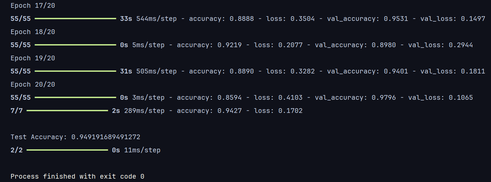
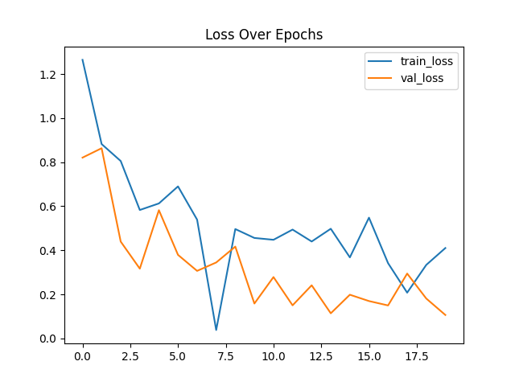
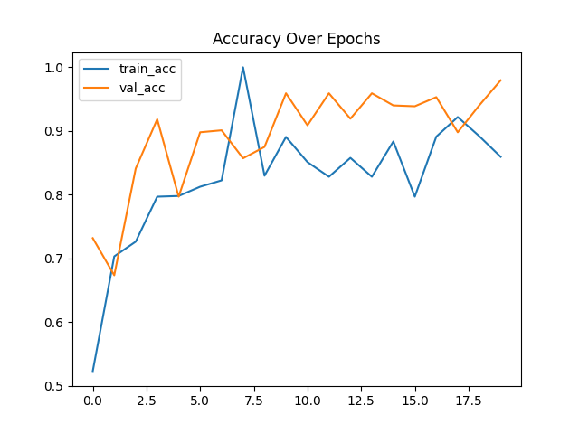
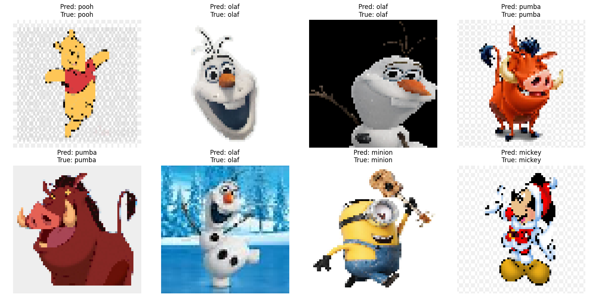

# Cartoon Character Classification

This project is a deep learning-based solution to classify cartoon characters such as Donald Duck, Mickey Mouse, Minions, Olaf, Winnie the Pooh, and Pumbaa using a Convolutional Neural Network (CNN) implemented in TensorFlow and Keras.

## Table of Contents
- [Project Overview](#project-overview)
- [Requirements](#requirements)
- [Dataset](#dataset)
- [Model Architecture](#model-architecture)
- [Training](#training)
- [Evaluation](#evaluation)
- [Results](#results)
- [Usage](#usage)
- [Visualizations](#visualizations)

## Project Overview

The objective of this project is to build a CNN model that can classify cartoon characters from a set of images. The dataset is divided into a training set and a test set, each containing images of cartoon characters. The model is trained using a variety of augmentations to improve generalization.

## Requirements

To run this project, you will need to install the following dependencies:

- Python 3.x
- TensorFlow 2.x
- Keras
- NumPy
- Pillow (PIL)
- Matplotlib

You can install the required packages using pip:

```bash
pip install tensorflow numpy pillow matplotlib
```

## Dataset
For this project, the following dataset was used: https://www.kaggle.com/datasets/sayehkargari/disney-characters-dataset  

The dataset is expected to be structured in the following way:

```bash
cartoon/
│
├── train/
│   ├── donald/
│   ├── mickey/
│   ├── minion/
│   ├── olaf/
│   ├── pooh/
│   └── pumba/
│
└── test/
    ├── donald/
    ├── mickey/
    ├── minion/
    ├── olaf/
    ├── pooh/
    └── pumba/
```
## Model Architecture

The model is a sequential CNN with the following architecture:
- **Conv2D**: Essential for feature extraction. These layers capture spatial hierarchies in the input images.
- **MaxPooling2D**: Reduces the spatial dimensions of the feature maps, which helps in reducing the computational cost and overfitting by extracting dominant features.
- **Flatten**: Converts the 2D feature maps into a 1D vector, which is necessary before passing data to the Dense layers.
- **Dense (Softmax)**: Essential for classification, providing the final output with class probabilities.

The model uses the Adam optimizer and categorical cross-entropy as the loss function since this is a multi-class classification problem.

## Training

The model is trained using the `ImageDataGenerator` from Keras, which applies the following augmentations to the training data:

- **Rescaling (normalization)**
- **Shear transformations**
- **Zoom transformations**
- **Horizontal flipping**

The model is trained for 20 epochs, and the training history is visualized to show the loss and accuracy over the epochs.

```python
history = model.fit(
    train_generator,
    steps_per_epoch=train_generator.samples // batch_size,
    epochs=20,
    validation_data=test_generator,
    validation_steps=test_generator.samples // batch_size
)
```

### Evaluation
After training, the model is evaluated on the test dataset to determine its accuracy.

```python
test_loss, test_acc = model.evaluate(test_generator)
print("\nTest Accuracy:", test_acc)
```
### Results
The project provides visualizations of:

- Loss and accuracy over the epochs (both training and validation).
- A comparison of predicted vs actual labels on a set of test images.

Example:

Additionally, an image grid is displayed where the model's predictions are compared to the true labels for a few sample images from the test set.

## Usage

1. **Prepare the Dataset**: Ensure that your dataset is structured as described in the [Dataset](#dataset) section.
2. **Train the Model**: Run the script to train the CNN on your dataset.
3. **Evaluate the Model**: After training, the model will be evaluated on the test set, and metrics like accuracy will be displayed.
4. **Visualize Results**: View the loss and accuracy over epochs, and inspect the prediction results with images.

To start the training, run the Python script:

```bash
python train_model.py
```

## Visualizations

The following plots show the model's performance during training and evaluation. The accuracy of the model ranged from 0.90 to 0.95, which is a solid result for a simple CNN model. Below are visualizations of the model’s loss, accuracy, and predictions.

### Accuracy Plot
This plot shows the final accuracy obtained during the testing phase of the model, with values ranging between 0.90 and 0.95.



### Loss Over Epochs
The plot below shows how the loss decreased over the training epochs. Loss represents how well (or poorly) the model's predictions match the actual labels.



### Accuracy Over Epochs
This plot shows the model's accuracy improving over each epoch during training and validation. Higher accuracy means the model is correctly classifying more images.



### Predictions vs True Labels
In this image, we compare the model's predictions against the true labels from a subset of test images. This provides insight into how well the model generalizes on unseen data.


